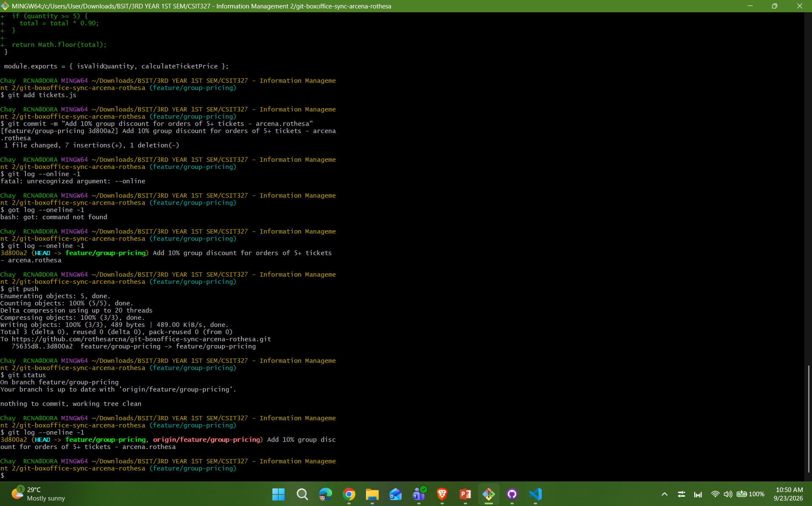
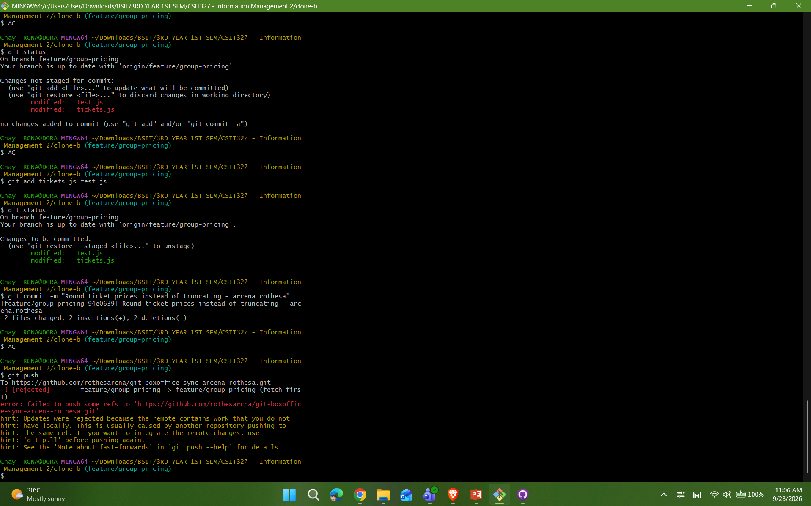
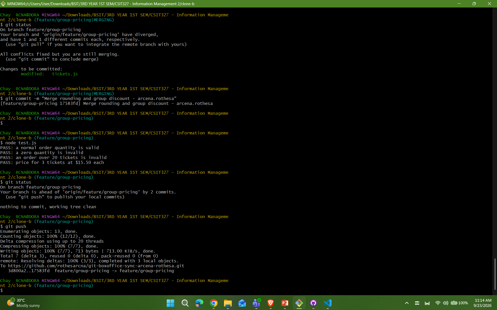
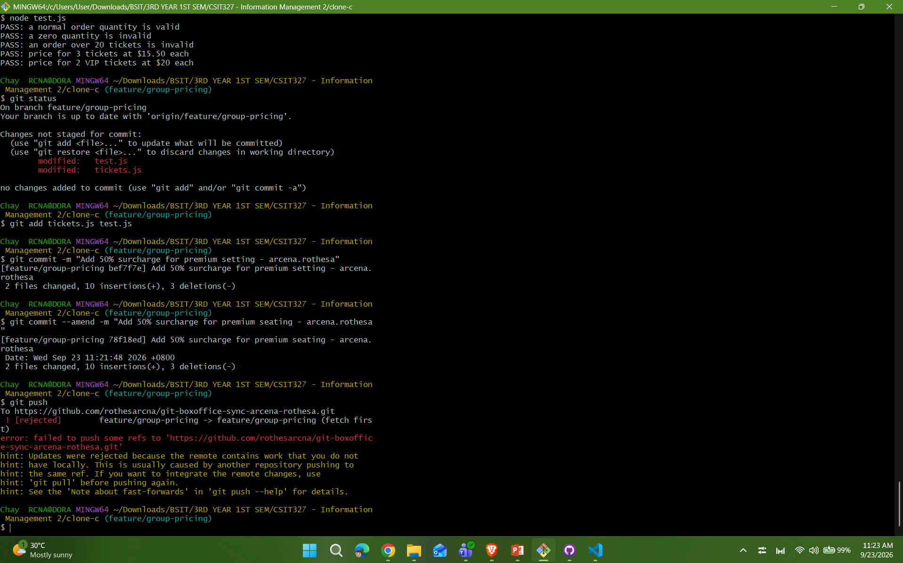
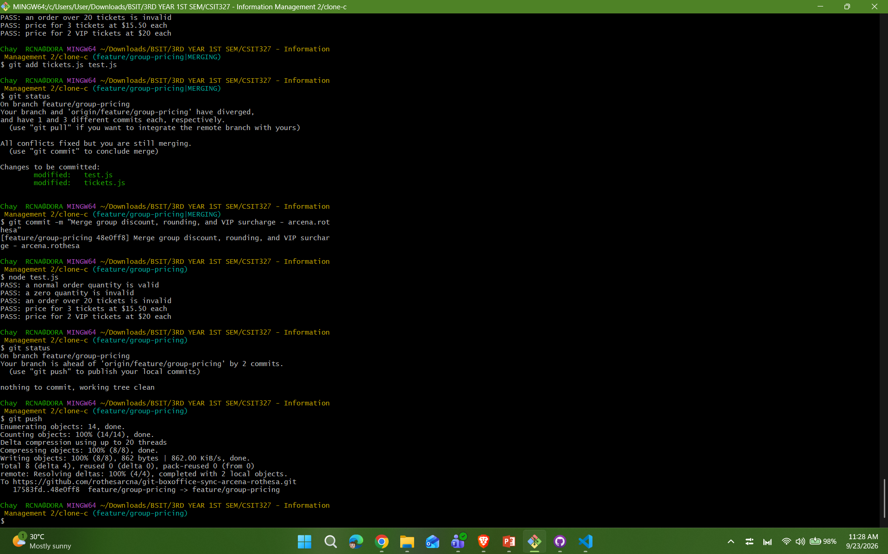
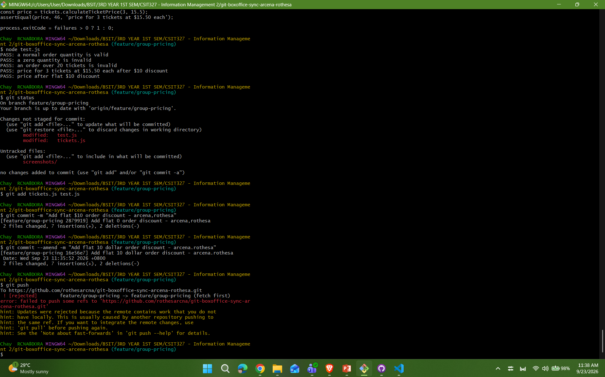
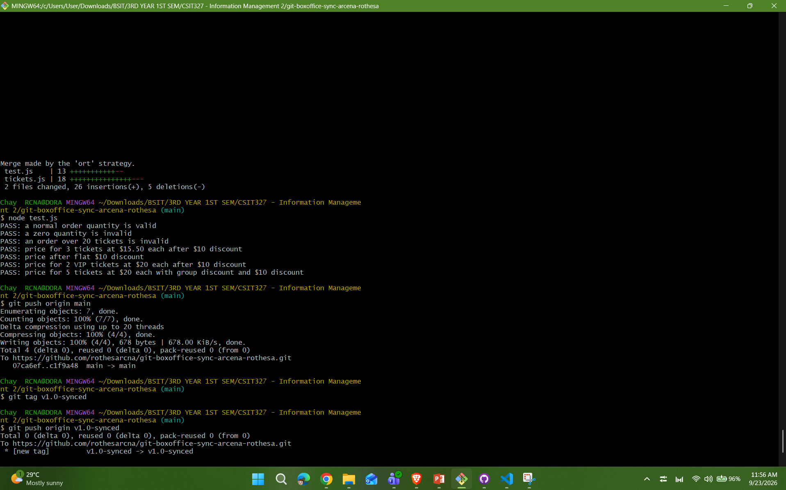

**Box Office Sync: Reconciling 3-Way Divergent Work on the Event Ticket**

**Final calculateTicketPrice Walkthrough**

Question 1 (Walk through the final calculateTicketPrice function and name which contributor's change is responsible for each part.)

The final calculateTicketPrice combines the changes made by the different contributors:

1\. Base ticket price — The original implementation calculates the total using quantity \* basePrice.

2\. 10% group discount — Clone A added the 10% discount when the order has 5 or more tickets.

3\. 50% VIP surcharge — Clone C added the 50% surcharge when the order is for VIP tickets.

4\. Flat $10 discount — Clone A later added a flat $10 discount to the order.

5\. Rounding — Clone B changed the final calculation from Math.floor() to Math.round().

The final calculation applies the group discount first, then the VIP surcharge when applicable, then the flat $10 discount, and finally rounds the result.

Question 2 (Compare Task 3's two-way conflict to Task 5's three-way conflict — what got harder with a third line of work?)

**Task 3: Two-Way Conflict vs. Task 5: Three-Way Conflict**

The conflict in Task 3 was a two-way conflict because Clone B had changed the rounding behavior while Clone A had added the group discount. Both changes were made from the original version of the same function, so the conflicting lines had to be combined. The final solution kept both the 10% group discount and Math.round().

The conflict in Task 5 was more complex because Clone C had its VIP surcharge change while the remote branch already contained the group discount and rounding changes. With three contributors' lines of work, it became harder to identify which changes should be kept together because Clone C's VIP change had to be combined with the group discount and rounding changes that were already on the remote branch. I also had to resolve conflicts in both tickets.js and test.js without losing any contributor's work.

Question 3 (Task 6's flat $10 discount changed the expected result of tests unrelated to your change (the group-discount and VIP tests). Why, and what does that tell you about "isolated" changes in shared code?)

**Task 6: Effect of the Flat $10 Discount**

The flat $10 discount changed the expected results of the existing group and VIP tests because all of these calculations use the same calculateTicketPrice function. The new discount was applied to the final total regardless of whether the order had a group discount or a VIP surcharge. For example, the VIP price changed from $60 to $50 after the $10 discount was applied. The group price also changed from $90 to $80.

This shows that a change that seems isolated can still affect other features when they share the same function or code. Even though I only intended to add a flat $10 discount, it changed the results of features that were already working. This means that changes in shared code cannot always be treated as completely isolated. Previous features and tests need to be checked again after making a new change to make sure that the new code does not cause unexpected effects.

Question 4 (If this were a real team of three, what one process change would have prevented all three rejected pushes?)

**Process Change to Prevent Rejected Pushes**

One process change that could prevent these rejected pushes is to require every contributor to fetch and synchronize with the shared remote branch before pushing. For example, the team could make it a rule to run git fetch and then merge or rebase the latest remote changes before every push. This would reduce the chance of pushing from an outdated local branch.

This process would help the team know if someone else had already pushed changes before they tried to push their own work. It would also give each contributor a chance to resolve conflicts locally and test the combined changes before sending them to the shared branch. By keeping the local branches updated before pushing, the team could avoid repeated rejected pushes and reduce the risk of conflicts becoming more difficult to resolve later.

**Screenshot Evidence**

Task 1

Task 2

Task 3

Task 4

Task 5

Task 6

Task 7

